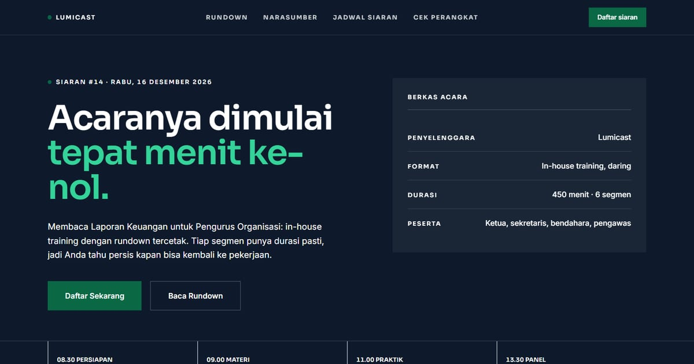

# Lumicast — Siaran Pelatihan untuk Pengurus Organisasi

Lumicast menyiarkan pelatihan in-house untuk pengurus organisasi dengan rundown tercetak. Siaran #14: Membaca Laporan Keuangan untuk Pengurus Organisasi, Rabu 16 Desember 2026.

**Demo live:** https://landing-lumicast.vercel.app



> Template landing page untuk bisnis fiktif. Formulir di dalamnya hanya demo dan tidak mengirim data.

## Konsep

Bahasa rupa **Rundown Siaran**: kolom waktu yang lurus, durasi tercetak, dan penanda status. Rapi dan terbaca, bukan meriah.

## Halaman

- `/` — Siaran #14 "Membaca Laporan Keuangan untuk Pengurus Organisasi": rundown, narasumber, dan pendaftaran
- `/jadwal-siaran` — jadwal ala panduan acara TV dengan batang durasi
- `/cek-perangkat` — daftar cek interaktif "Siap siar" sebelum siaran dimulai

## Teknologi

- Next.js 15.5 (App Router) dan React 19
- Tailwind CSS v4
- JavaScript
- Framer Motion (animasi hero)
- Font: Sora, Inter (next/font)
- SEO: metadata per halaman, Open Graph, JSON-LD, sitemap.xml, dan robots.txt

## Menjalankan secara lokal

```bash
npm install
npm run dev
```

Buka http://localhost:3000. Untuk build produksi: `npm run build` lalu `npm start`.

---

Bagian dari koleksi 17 template landing page di [PortalLanding](https://portal-landing-seven.vercel.app). Dibuat oleh [PintuWeb](https://pintuweb.com), jasa pembuatan website.
